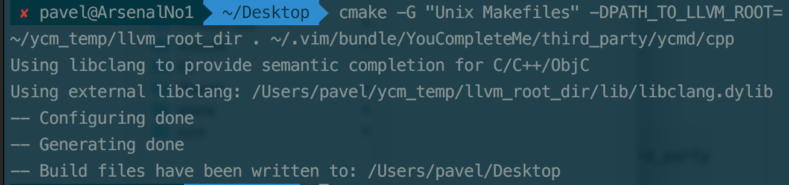

--
layout:post
title:osx ycm installtion
categories:linux,osx
description:a very diffcult plug-in installtion for those who new to linux
keywords:ycm,vim,linux
--
## What is this article about
So there are so many great plug-ins out there for vim users,
so far most of the plug-ins I have downloaded were simply using 
vundle an awesome plug-in manger, won't spend time on this but go
ahead to the github page [vundle's page](https://github.com/VundleVim/Vundle.vim) 
*this article is for amateur only!!!*

### What you would need to begin with
- vundle
- libclang (can be download here [libclang](http://releases.llvm.org/download.html))
- python2/3
- vim...

