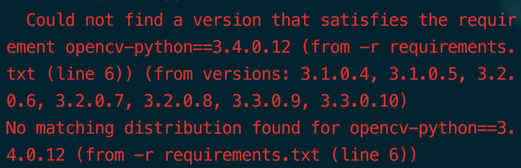

So I was working on python these days while I just
jumped in to this issue when install requirment.txt

*Solution:*
-Download opencv-python [click here](https://pypi.python.org/pypi/opencv-python#downloads)
(*Make sure to choose the right one for ya
 ie if you are using python 3.6 as me and on OSX,
 downloadopencv_python-3.4.0.12-cp36-cp36m-macosx_10_6_intel.macosx_10_9_intel.macosx_10_9_x86_64.macosx_10_10_intel.macosx_10_10_x86_64.whl
 where cp36 indicates python 3.6*)
-cd to the directory of python packages
- < pip3 install 'Filename' replace with opencv....
>

Giving that I am new to python I searched up
how to install opencv-python on OSX but I
ended up install a 3.3 version openncv-python
using command <pip install opencv-python>

So the only solution for me was install a specifc
version of python . This took me a bit of time since
there was many articles on manually installation a
non-contribution opencv-python also I do need a latest
version of python. Hope this one helps you.

Cheers

